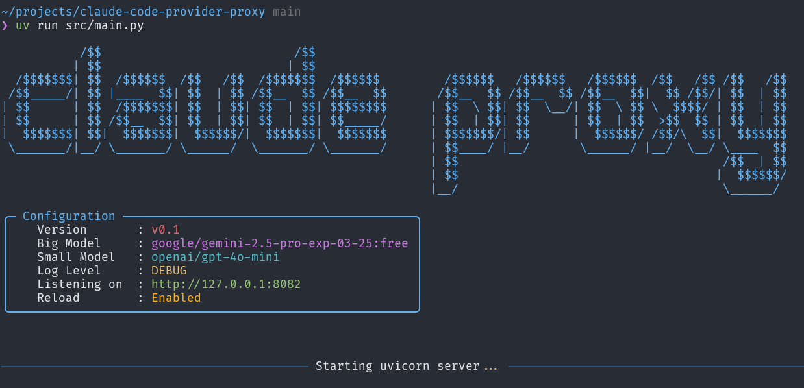

# OpenRouter Proxy for Claude Code

A proxy service that allows Anthropic API requests to be routed through OpenRouter to access alternative models.



## Overview

Claude Proxy provides a compatibility layer between Claude Code and alternative models available through OpenRouter. It dynamically selects models based on the requested Claude model name, mapping Opus/Sonnet to a configured "big model" and Haiku to a "small model".

Key features:

- FastAPI web server exposing Anthropic-compatible endpoints
- Format conversion between Anthropic and OpenAI requests/responses
- Support for both streaming and non-streaming responses
- Dynamic model selection based on requested Claude model
- Provider-specific modifications (extensible in order to support edge-cases)
- Accurate token counting functionality
- Detailed request/response logging

## Getting Started

### Prerequisites

- Python 3.10+
- OpenRouter API key
- [uv](https://github.com/astral-sh/uv)


### Configuration

Create a `.env` file with your configuration:

```env
OPENROUTER_API_KEY=<key>
BIG_MODEL_NAME=deepseek/deepseek-chat-v3-0324
SMALL_MODEL_NAME=openai/gpt-4o-mini
LOG_LEVEL=DEBUG
```

See `config.py` to configure.

### Running the Server

```bash
uv run src/main.py
```

### Running Claude Code

```bash
ANTHROPIC_BASE_URL=http://localhost:8082 claude   
```

## Usage

The proxy server exposes the following endpoints:

- `POST /v1/messages`: Create a message (main endpoint)
- `POST /v1/messages/count_tokens`: Count tokens for a request
- `GET /`: Health check endpoint

## License

[LICENSE](./LICENSE)

